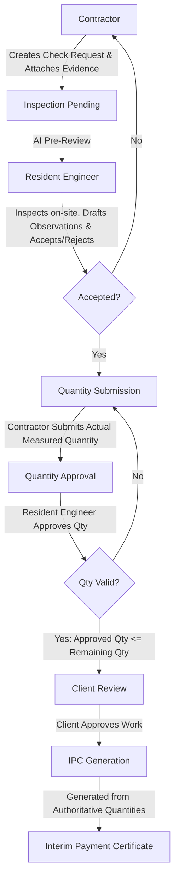

# Architecture & Workflow

SiteFlow AI is an AI-powered construction project-control platform for residential and commercial works. Built for deterministic quality assurance and financial control, it digitizes the complete lifecycle from Check Requests to Interim Payment Certificates (IPC).

## Tech Stack

### Backend
- **Framework**: FastAPI (>=0.110.0)
- **Database**: SQLAlchemy (>=2.0.28) / SQLite (Development)
- **Validation**: Pydantic (>=2.6.4)
- **Authentication**: PyJWT (>=2.8.0), PassLib with bcrypt

### Frontend
- **Framework**: React (^18.2.0)
- **Routing**: React Router DOM (^6.22.3)
- **Tooling**: Vite (^5.1.6) & TypeScript (^5.2.2)
- **Icons**: Lucide React (^0.359.0)

## Role-Based Workflow
The platform utilizes a strict server-side verified workflow with Role-Based Access Control (RBAC):

1. **Contractor**: Creates Check Requests and attaches evidence. Submits measured quantities after inspection acceptance.
2. **Resident Engineer (RE)**: Inspects on-site, drafts observations, and accepts or rejects the request. Approves submitted quantities.
3. **Client**: Reviews and approves work, generating the final IPC.

## Database Schema Summary
- **Users**: RBAC (Contractor, RE, Client)
- **Projects**: High level tracking.
- **BOQ Items**: Bill of Quantities. Core BOQ structures (quantities, rates, units) remain immutable throughout the normal execution lifecycle.
- **Check Requests**: Requests for inspection with attached evidence.
- **Inspections & Observations**: Results from RE's inspection.
- **Quantity Approvals**: Atomic quantity validation mathematically prevents over-approvals natively within the database transactions (approved quantity cannot exceed remaining contractual BOQ quantity).
- **IPCs**: Final generated Interim Payment Certificates.

## AI Layer
**Note:** The AI features are advisory-only. 
The platform features AI-assisted processing that helps with document readiness and pre-reviews, but keeps final authoritative decisions human-in-the-loop.
